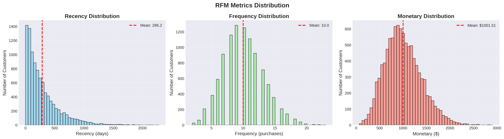
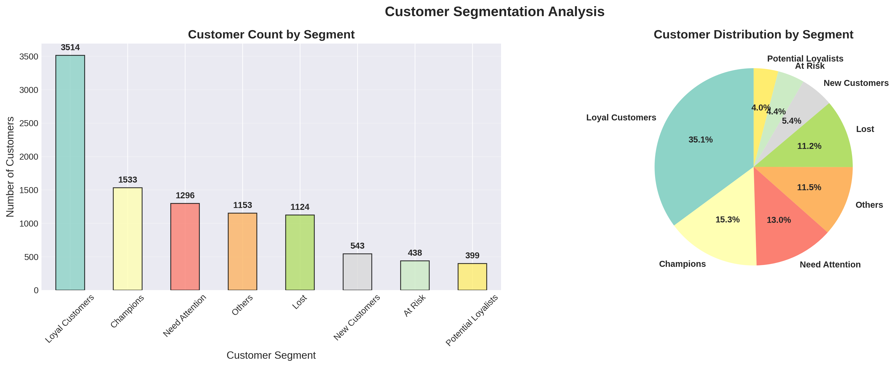
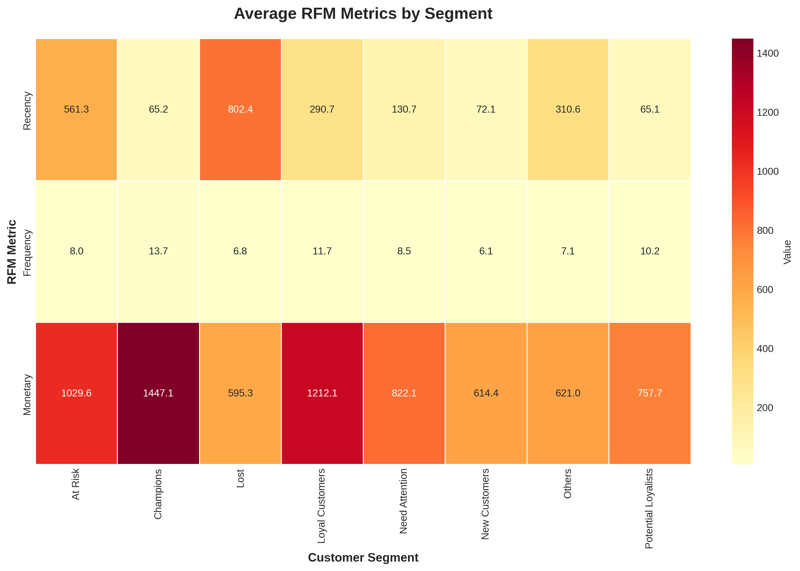
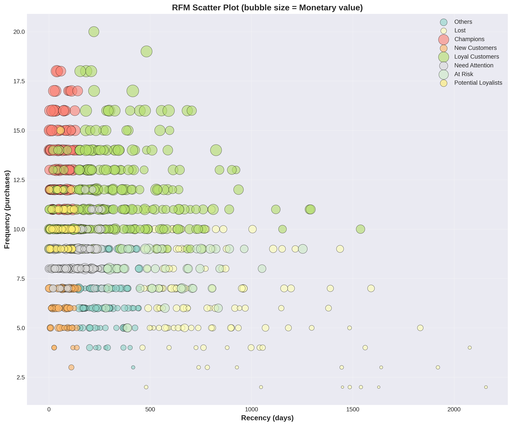
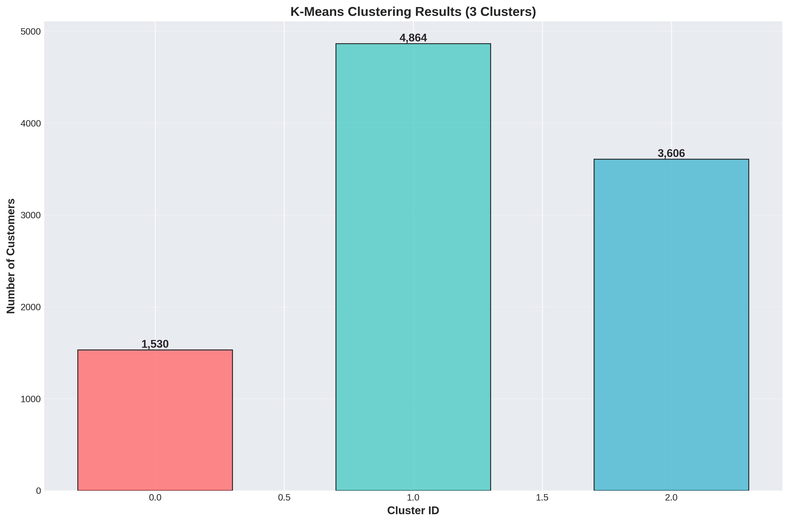
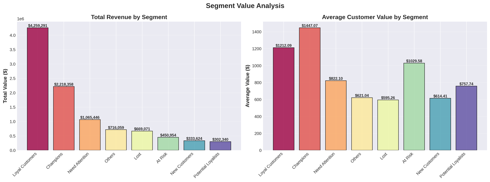
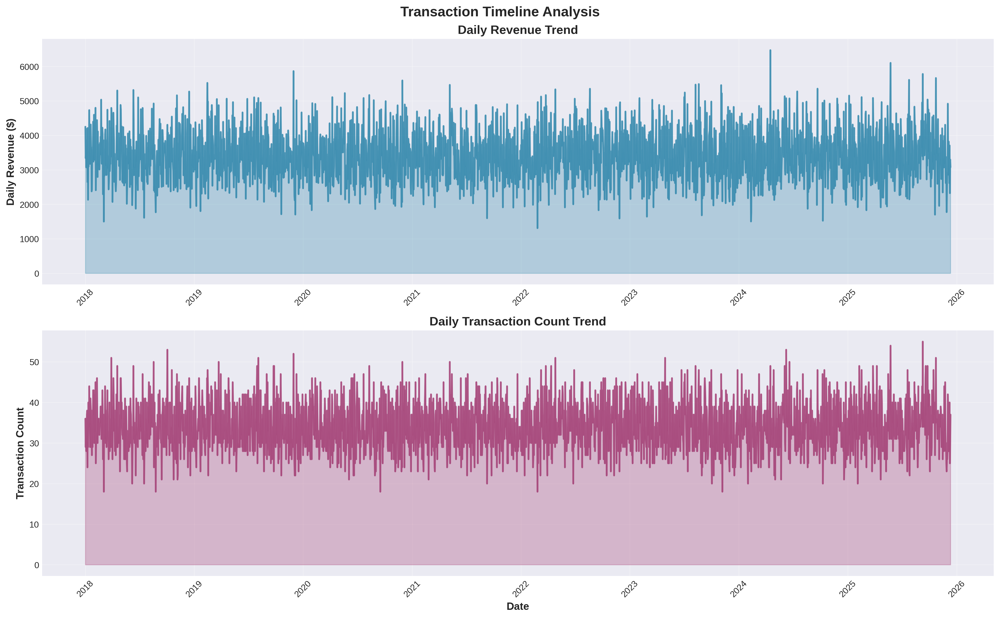

# Predictive CLV Engine (Müşteri Yaşam Boyu Değeri Tahmin Sistemi)

> Olasılıksal modeller ve makine öğrenmesi kullanarak uçtan uca müşteri yaşam boyu değeri tahmin sistemi

[English](README.md) | **Türkçe**

## 🎯 Temel Sonuçlar

- **Yüksek değerli müşterileri belirlendi**: Müşterilerin %15,3'ü toplam gelirin %22,2'sini oluşturuyor
- **10.000 müşteri 8 gruba ayrıldı** - Hedefli pazarlama için aksiyona dönüştürülebilir segmentler
- **Gelecek değer tahmini yapıldı** - BG/NBD ve Pareto/NBD olasılıksal modelleri kullanılarak
- **Gelir yoğunlaşması keşfedildi**: Müşterilerin %50,5'i gelirin %64,7'sini sağlıyor
- **438 riskli müşteri işaretlendi** - $450K+ potansiyel kayıp gelir
- **100.000 işlem analiz edildi** - 7 yıllık e-ticaret verisi

## 📊 Örnek Görselleştirmeler

### RFM Dağılım Analizi


### Müşteri Segmentasyonu


### Segment Karakteristikleri


### RFM 3D Dağılım Grafiği


### K-Means Kümeleme Sonuçları


### Segment Değer Analizi


### İşlem Zaman Çizelgesi


## Bu Proje Ne Yapıyor?

Bu sistem, e-ticaret işletmelerinin hangi müşterilerin en değerli olduğunu anlamasına ve gelecekte ne kadar harcayacaklarını tahmin etmesine yardımcı olur. Şunları birleştirir:

- **RFM Analizi**: Müşterileri yenilik, sıklık ve parasal değere göre değerlendirir
- **Müşteri Segmentasyonu**: Müşterileri 8 segmente ayırır (Şampiyonlar, Sadık, Risk Altında, vb.)
- **CLV Tahmini**: Gelecekteki müşteri değerini tahmin etmek için istatistiksel modeller kullanır
- **Aksiyona Dönüştürülebilir İçgörüler**: Her müşteri grubu için özel öneriler sunar

## Neden Önemli?

Müşteri yaşam boyu değerini bilmek şunlar için kritiktir:
- Pazarlama bütçesini verimli şekilde dağıtmak
- Hangi müşterilere öncelik verileceğini belirlemek
- Yüksek değerli müşteri kaybını önlemek
- Edinim maliyetlerini optimize etmek

Bu proje, sıfırdan eksiksiz bir CLV tahmin sistemi nasıl kurulacağını gösterir.

## 🚀 Projeyi Nasıl Çalıştırırım?

### Adım 1: Python Kur

Python 3.9 veya üzeri yüklü olduğundan emin olun.

**Python versiyonunuzu kontrol edin:**
```bash
python --version
```

Python yoksa [python.org](https://www.python.org/downloads/) adresinden indirin

### Adım 2: Projeyi İndir

**Seçenek A: Git Kullanarak**
```bash
git clone https://github.com/Egekocaslqn00/predictive-clv-engine.git
cd predictive-clv-engine
```

**Seçenek B: ZIP İndir**
1. https://github.com/Egekocaslqn00/predictive-clv-engine adresine git
2. Yeşil "Code" butonuna tıkla
3. "Download ZIP" seç
4. İstediğin yere çıkart
5. O klasörde terminal/komut istemi aç

### Adım 3: Sanal Ortam Oluştur

**Windows'ta:**
```bash
python -m venv venv
venv\Scripts\activate
```

**Mac/Linux'ta:**
```bash
python3 -m venv venv
source venv/bin/activate
```

Komut satırının başında `(venv)` görmelisin.

### Adım 4: Bağımlılıkları Yükle

```bash
pip install -r requirements.txt
```

Bu, gerekli tüm paketleri yükler (pandas, numpy, scikit-learn, lifetimes, matplotlib, seaborn).

**3-5 dakika bekle** - Yükleme tamamlanacak.

### Adım 5: Veri Klasörlerini Oluştur

**Windows'ta:**
```bash
mkdir data
mkdir data\raw
mkdir data\processed
```

**Mac/Linux'ta:**
```bash
mkdir -p data/raw data/processed
```

### Adım 6: Örnek Veri Oluştur

```bash
python generate_sample_data.py
```

**Beklenen çıktı:**
```
Generating 100,000 transactions for 10,000 customers...
✓ Data generated successfully!
  Shape: (100000, 9)
  Date range: 2018-01-01 to 2025-12-11
  Total amount: $10,015,143.57
✓ Data saved to: data/raw/ecommerce_transactions.csv
```

### Adım 7: Tam Analizi Çalıştır

```bash
python run_complete_analysis.py
```

**Bu 2-5 dakika sürecek.** Şunları göreceksin:

```
================================================================================
E-COMMERCE CUSTOMER LIFETIME VALUE (CLV) PREDICTION AND SEGMENTATION
================================================================================

[STEP 1] Loading and Exploring Data...
Total Customers: 10,000
Total Transactions: 100,000
Total Revenue: $10,015,143.57

[STEP 2] Data Cleaning and Preparation...
[STEP 3] RFM Analysis...
Recency: 286.2 days (avg)
Frequency: 10.0 purchases (avg)
Monetary: $1,001.51 (avg)

[STEP 4] Customer Segmentation (K-Means)...
Optimal number of clusters: 3

[STEP 5] Advanced CLV Modeling...
BG/NBD Model: ✓
Pareto/NBD Model: ✓

[STEP 6] Model Evaluation and Comparison...
[STEP 7] Business Insights and Recommendations...

Champions: 1,533 customers (15.3%)
  - Average CLV: $1,447.07
  - Total Value: $2,218,000+

Loyal Customers: 3,514 customers (35.1%)
  - Average CLV: $1,212.09
  - Total Value: $4,260,000+

At Risk: 438 customers (4.4%)
  - Average CLV: $1,029.58
  - Total Value: $450,000+

[STEP 8] Saving Results...
✓ Results saved successfully!

================================================================================
Analysis completed successfully!
================================================================================
```

### Adım 8: Görselleştirmeleri Oluştur

```bash
python create_visualizations_and_report.py
```

**Bu `reports/figures/` klasöründe 7 grafik oluşturur:**
1. RFM dağılım grafikleri
2. Müşteri segmenti pasta grafiği
3. Segment karakteristikleri ısı haritası
4. RFM dağılım grafiği
5. K-Means kümeleri
6. Segment değer analizi
7. İşlem zaman çizelgesi

### Adım 9: Sonuçları Görüntüle

**Oluşturulan dosyaları kontrol et:**

**Windows'ta:**
```bash
dir data\processed
dir reports\figures
```

**Mac/Linux'ta:**
```bash
ls data/processed
ls reports/figures
```

**Göreceksin:**
- `data/processed/rfm_analysis.parquet` - Her müşteri için RFM metrikleri
- `data/processed/rfm_with_clv.parquet` - CLV tahminleri
- `data/processed/segmented_customers.parquet` - Müşteri segmentleri
- `reports/figures/*.png` - 7 görselleştirme grafiği

### Adım 10: Görselleştirmeleri Aç

`reports/figures/` klasörüne git ve PNG dosyalarını aç:
- Müşteri dağılım grafikleri
- Segment analizi
- CLV tahminleri
- İş içgörüleri

## 📊 Sonuçları Anlama

### Müşteri Segmentleri

Analizi çalıştırdıktan sonra 8 müşteri segmenti göreceksin:

| Segment | Müşteri % | Gelir % | Ne Yapmalı |
|---------|-----------|---------|------------|
| **Şampiyonlar** | 15,3% | 22,2% | VIP muamelesi, özel teklifler, erken erişim |
| **Sadık Müşteriler** | 35,1% | 42,5% | Sadakat programları, kişiselleştirilmiş öneriler |
| **Risk Altında** | 4,4% | 4,5% | Geri kazanma kampanyaları, özel indirimler |
| **Yeni Müşteriler** | 5,4% | 3,3% | Onboarding programları, hoş geldin teklifleri |
| **Kayıp** | 11,2% | 6,7% | Neden ayrıldıklarını öğren, çok özel teklifler |
| **Dikkat Gerekli** | 13,0% | 10,6% | Yeniden etkileşim kampanyaları |
| **Potansiyel Sadıklar** | 4,0% | 3,0% | Tekrar alışverişi teşvik et |
| **Diğerleri** | 11,5% | 7,1% | Minimal pazarlama harcaması |

### Temel İçgörüler

1. **Müşterilerin %15,3'ü (Şampiyonlar) gelirin %22,2'sini oluşturuyor** - En iyi çabanı buraya odakla
2. **Müşterilerin %50,5'i gelirin %64,7'sini sağlıyor** - 80/20 kuralı iş başında
3. **438 riskli müşteri $450K+ değerinde** - Kaybı önlemek için acil aksiyon gerekli
4. **Ortalama müşteri değeri: $1,001** - Edinim maliyetleri için referans

## 🛠️ Sorun Giderme

### "Python bulunamadı"
[python.org](https://www.python.org/downloads/) adresinden Python kur

### "pip bulunamadı"
```bash
python -m ensurepip --upgrade
```

### "Module not found: pandas"
Sanal ortamın aktif olduğundan emin ol:
```bash
# Windows
venv\Scripts\activate

# Mac/Linux
source venv/bin/activate
```

Sonra tekrar yükle:
```bash
pip install -r requirements.txt
```

### "Permission denied"
**Windows'ta:** Komut istemini Yönetici olarak çalıştır

**Mac/Linux'ta:** Komutların başına `sudo` ekle

### Görselleştirmeler görünmüyor
Şunu çalıştırdığından emin ol:
```bash
python create_visualizations_and_report.py
```

Dosyaların var olup olmadığını kontrol et:
```bash
ls reports/figures/  # Mac/Linux
dir reports\figures  # Windows
```

## Proje Yapısı

```
├── src/                        # Ana analiz modülleri
│   ├── data_processing.py      # Veri temizleme
│   ├── rfm_analysis.py         # RFM hesaplamaları
│   ├── segmentation.py         # Müşteri segmentasyonu
│   ├── clv_modeling.py         # CLV tahmin modelleri
│   └── visualization.py        # Grafikler
├── data/
│   ├── raw/                    # Orijinal işlemler
│   └── processed/              # Analiz sonuçları
├── reports/
│   └── figures/                # Oluşturulan görselleştirmeler
├── notebooks/                  # Jupyter notebook'lar
└── config/                     # Konfigürasyon dosyaları
```

## Nasıl Çalışıyor?

### 1. RFM Analizi

Her müşteri 3 metrikte 1-5 arası puan alır:
- **Recency (Yenilik)**: Ne kadar yakın zamanda satın aldı? (ort: 286 gün)
- **Frequency (Sıklık)**: Ne sıklıkla satın alıyor? (ort: 10 alışveriş)
- **Monetary (Parasal)**: Ne kadar harcıyor? (ort: $1,001)

### 2. Müşteri Segmentasyonu

RFM puanları, her müşterinin hangi 8 segmentten birine ait olduğunu belirler.

### 3. CLV Tahmini

İki olasılıksal model gelecek değeri tahmin eder:

**BG/NBD (Beta-Geometric/Negative Binomial)**
- Müşterinin kaç kez satın alacağını tahmin eder
- Müşterilerin pasif hale gelmesini hesaba katar
- CLV tahmini için endüstri standardı

**Pareto/NBD**
- Farklı varsayımlarla alternatif model
- Tahminler için ikinci görüş sağlar

### 4. K-Means Kümeleme

Makine öğrenmesi, davranış kalıplarına dayalı 3 doğal müşteri grubu bulur.

## Teknolojiler

- **pandas** & **numpy**: Veri manipülasyonu
- **scikit-learn**: Makine öğrenmesi (K-Means)
- **lifetimes**: BG/NBD ve Pareto/NBD modelleri
- **matplotlib** & **seaborn**: Görselleştirmeler
- **jupyter**: İnteraktif analiz

## Neler Öğrendim

- İleri seviye istatistiksel modeller (BG/NBD, Pareto/NBD) uygulama
- Müşteri segmentasyon stratejileri
- Veriyi iş önerilerine çevirme
- Üretim kalitesinde veri bilimi kodu yazma
- Etkili görselleştirmeler oluşturma

## Gelecek İyileştirmeler

- Daha iyi doğruluk için derin öğrenme modelleri
- Gerçek zamanlı tahmin API'si
- İş dashboard'u
- A/B test çerçevesi
- Pazarlama platformu entegrasyonu

## İletişim

GitHub: [@Egekocaslqn00](https://github.com/Egekocaslqn00)

---

*E-ticaret analitiği için veri bilimi ve makine öğrenmesi becerilerini göstermek amacıyla geliştirilmiştir*
